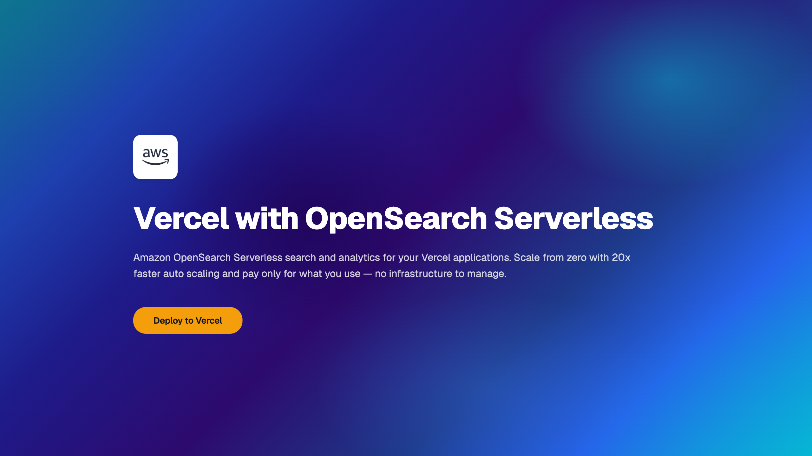

# OpenSearch Recipe Search Demo

A full-text **recipe search engine** powered by [Amazon OpenSearch Serverless](https://aws.amazon.com/opensearch-service/features/serverless/) and [Next.js](https://nextjs.org/), deployed on Vercel.



## Features

- **Full-text search** with relevance scoring and fuzzy matching
- **Faceted filtering** — filter by cuisine, dietary tags, and cook time
- **Real-time aggregations** — filter counts update dynamically
- **Search highlighting** — matched terms are visually highlighted in results
- **Autocomplete** — prefix-based suggestions as you type
- **Expandable recipe cards** — click to see full ingredients with measurements and step-by-step instructions
- **Relevance scores** — visible per-result to show ranking quality
- **107 recipes** across 18 cuisines with detailed cooking instructions

## OpenSearch Features Demonstrated

| Feature | How it's used |
|---------|---------------|
| `multi_match` | Search across title, description, ingredients with field boosting |
| `fuzziness: AUTO` | Typo tolerance (e.g. "chiken" → "chicken") |
| `highlight` | `<mark>` tags around matched terms in results |
| `aggregations` | Faceted counts for cuisine, diet, cook time ranges |
| `match_phrase_prefix` | Autocomplete dropdown as you type |
| `range` aggregation | Cook time bucketed into human-friendly ranges |
| `bool` query | Combine text search with filter clauses |

## Getting Started

### Prerequisites

- An [Amazon OpenSearch Serverless](https://aws.amazon.com/opensearch-service/features/serverless/) collection (Search type)
- AWS credentials with data access policy permissions
- Node.js 18+

### Setup

```bash
npm install
cp .env.local.example .env.local
# Edit .env.local with your AOSS endpoint and AWS credentials
```

### Seed the index

```bash
npm run seed
```

This creates a `recipes` index with 107 recipes across 18 cuisines.

### Run locally

```bash
npm run dev
```

Open [http://localhost:3000](http://localhost:3000).

## Deploy on Vercel

[](https://vercel.com/new/clone?repository-url=https://github.com/KishoreKicha14/aws-opensearch-demo&env=OPENSEARCH_ENDPOINT,AWS_REGION,AWS_ACCESS_KEY_ID,AWS_SECRET_ACCESS_KEY&envDescription=Amazon%20OpenSearch%20Serverless%20credentials&envLink=https://docs.aws.amazon.com/opensearch-service/latest/developerguide/serverless.html)

### Required Environment Variables

| Variable | Description |
|----------|-------------|
| `OPENSEARCH_ENDPOINT` | Your AOSS collection endpoint (e.g. `https://xxx.us-east-1.aoss.amazonaws.com`) |
| `AWS_REGION` | AWS region (e.g. `us-east-1`) |
| `AWS_ACCESS_KEY_ID` | AWS access key |
| `AWS_SECRET_ACCESS_KEY` | AWS secret key |
| `AWS_SESSION_TOKEN` | (Optional) Session token for temporary credentials |

### Authentication

This demo uses **AWS SigV4 signing** with the `aoss` service. Your IAM principal needs a data access policy on the collection granting `aoss:ReadDocument`, `aoss:WriteDocument`, `aoss:CreateIndex`, and `aoss:DescribeIndex`.

## Architecture

```
┌─────────────────┐         ┌──────────────────────────────┐
│   Vercel        │         │  Amazon OpenSearch Serverless │
│   (Next.js)     │────────▶│  (Search Collection)         │
│                 │◀────────│                              │
│  • SSR search   │  SigV4  │  • Inverted indices          │
│  • API routes   │         │  • Aggregations              │
│  • Autocomplete │         │  • Highlighting              │
└─────────────────┘         └──────────────────────────────┘
```

## Project Structure

```
app/
├── api/suggest/route.ts    # Autocomplete API endpoint
├── globals.css             # Tailwind + shadcn theme
├── layout.tsx              # Root layout with Geist Mono font
└── page.tsx                # Main search page (SSR)

components/
├── explanation.tsx         # Info panel with banner
├── facets.tsx              # Sidebar filter controls
├── loading.tsx             # Skeleton loading state
├── recipe-card.tsx         # Expandable result card
├── search-interface.tsx    # Main search UI (client component)
└── ui/                     # shadcn/ui primitives

lib/opensearch/
├── client.ts              # AOSS client with SigV4 signing
├── queries.ts             # Search + autocomplete queries
├── recipes.ts             # 107 recipe dataset
└── seed.ts                # Index creation + bulk seeding
```

## Learn More

- [Amazon OpenSearch Serverless](https://docs.aws.amazon.com/opensearch-service/latest/developerguide/serverless.html)
- [OpenSearch Query DSL](https://opensearch.org/docs/latest/query-dsl/)
- [OpenSearch Aggregations](https://opensearch.org/docs/latest/aggregations/)
- [Next.js Documentation](https://nextjs.org/docs)
